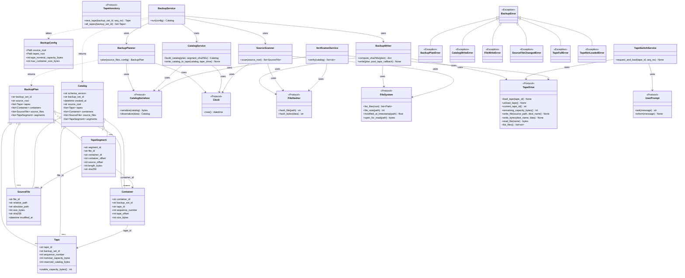

# Class Diagram

```mermaid
classDiagram
    %% ── CONFIG ──────────────────────────────────────────
    class BackupConfig {
        +Path source_root
        +Path tapes_root
        +int tape_nominal_capacity_bytes
        +int max_container_size_bytes
    }

    %% ── DOMAIN ──────────────────────────────────────────
    class Tape {
        +str tape_id
        +str backup_set_id
        +int sequence_number
        +int nominal_capacity_bytes
        +int reserved_catalog_bytes
        +usable_capacity_bytes() int
    }
    class Container {
        +str container_id
        +str backup_set_id
        +str tape_id
        +int sequence_number
        +int tape_offset
        +int size_bytes
    }
    class SourceFile {
        +str file_id
        +str relative_path
        +str absolute_path
        +int size_bytes
        +str sha256
        +datetime modified_at
    }
    class TapeSegment {
        +str segment_id
        +str file_id
        +str container_id
        +int container_offset
        +int source_offset
        +int length_bytes
        +str sha256
    }
    class BackupPlan {
        +str backup_set_id
        +str source_root
        +list~Tape~ tapes
        +list~Container~ containers
        +list~SourceFile~ source_files
        +list~TapeSegment~ segments
    }
    class Catalog {
        +str schema_version
        +str backup_set_id
        +datetime created_at
        +str source_root
        +list~Tape~ tapes
        +list~Container~ containers
        +list~SourceFile~ source_files
        +list~TapeSegment~ segments
    }

    BackupPlan "1" o-- "many" Tape
    BackupPlan "1" o-- "many" Container
    BackupPlan "1" o-- "many" SourceFile
    BackupPlan "1" o-- "many" TapeSegment
    Catalog "1" o-- "many" Tape
    Catalog "1" o-- "many" Container
    Catalog "1" o-- "many" SourceFile
    Catalog "1" o-- "many" TapeSegment
    TapeSegment --> Container : container_id
    TapeSegment --> SourceFile : file_id
    Container --> Tape : tape_id

    %% ── INTERFACES ──────────────────────────────────────
    class CatalogSerializer {
        <<Protocol>>
        +serialize(catalog) bytes
        +deserialize(data) Catalog
    }
    class Clock {
        <<Protocol>>
        +now() datetime
    }
    class FileHasher {
        <<Protocol>>
        +hash_file(path) str
        +hash_bytes(data) str
    }
    class FileSystem {
        <<Protocol>>
        +list_files(root) list~Path~
        +file_size(path) int
        +modified_at_timestamp(path) float
        +open_for_read(path) bytes
    }
    class TapeDrive {
        <<Protocol>>
        +load_tape(tape_id) None
        +unload_tape() None
        +current_tape_id() str
        +remaining_capacity_bytes() int
        +write_file(source_path, dest_name) None
        +write_bytes(dest_name, data) None
        +read_file(name) bytes
        +list_files() list~str~
    }
    class TapeInventory {
        <<Protocol>>
        +next_tape(backup_set_id, seq_no) Tape
        +all_tapes(backup_set_id) list~Tape~
    }
    class UserPrompt {
        <<Protocol>>
        +ask(message) str
        +inform(message) None
    }

    %% ── SERVICES ─────────────────────────────────────────
    class BackupService {
        +run(config) Catalog
    }
    class BackupPlanner {
        +plan(source_files, config) BackupPlan
    }
    class BackupWriter {
        +compute_sha256s(plan) dict
        +write(plan, post_tape_callback) None
    }
    class CatalogService {
        +build_catalog(plan, segment_sha256s) Catalog
        +write_catalog_to_tape(catalog, tape_drive) None
    }
    class SourceScanner {
        +scan(source_root) list~SourceFile~
    }
    class TapeSwitchService {
        +request_and_load(tape_id, seq_no) None
    }
    class VerificationService {
        +verify(catalog) list~str~
    }

    BackupService --> BackupPlanner : uses
    BackupService --> SourceScanner : uses
    BackupService --> BackupWriter : uses
    BackupService --> CatalogService : uses
    BackupService ..> BackupConfig : takes
    BackupService ..> Catalog : returns

    BackupPlanner --> CatalogSerializer : uses
    BackupPlanner --> Clock : uses
    BackupPlanner ..> BackupPlan : returns

    BackupWriter --> TapeDrive : uses
    BackupWriter --> FileSystem : uses
    BackupWriter --> FileHasher : uses

    CatalogService --> CatalogSerializer : uses
    CatalogService --> Clock : uses

    SourceScanner --> FileSystem : uses
    SourceScanner --> FileHasher : uses
    SourceScanner --> Clock : uses

    TapeSwitchService --> TapeDrive : uses
    TapeSwitchService --> UserPrompt : uses

    VerificationService --> TapeDrive : uses
    VerificationService --> CatalogSerializer : uses
    VerificationService --> FileHasher : uses

    %% ── EXCEPTIONS ───────────────────────────────────────
    class BackupError { <<Exception>> }
    class BackupPlanError { <<Exception>> }
    class CatalogWriteError { <<Exception>> }
    class FileWriteError { <<Exception>> }
    class SourceFileChangedError { <<Exception>> }
    class TapeFullError { <<Exception>> }
    class TapeNotLoadedError { <<Exception>> }

    BackupError <|-- BackupPlanError
    BackupError <|-- CatalogWriteError
    BackupError <|-- FileWriteError
    BackupError <|-- SourceFileChangedError
    BackupError <|-- TapeFullError
    BackupError <|-- TapeNotLoadedError
```
